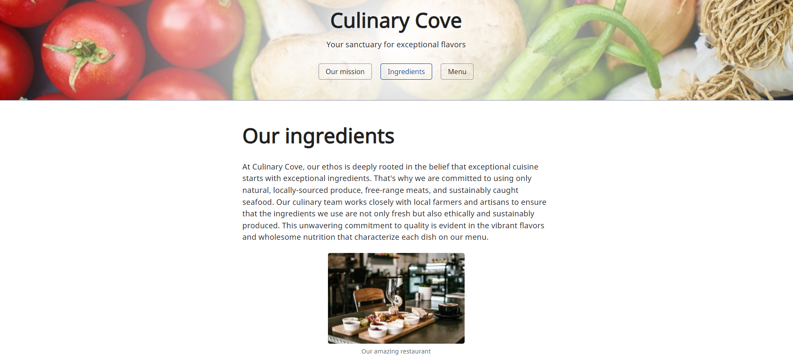

# My PHP Projects

Welcome to my repository of PHP projects! This repository is a collection of small projects I’ve created while learning PHP. Each project is organized into its own branch, making it easy to navigate and explore the code for each specific project.

## Projects Overview

### 1. **Form with Laravel, and MySQL**

This project is a form submission system built using Laravel, and MySQL. It demonstrates how to handle form data, perform validation, and store/delete the data in a MySQL database using Laravel’s Eloquent ORM.

**Sneak Peek:**

### 2. **Restaurant Page**

This project is a simple restaurant web page that displays menu items, special offers, and other information. The page is built using PHP.

**Sneak Peek:**

